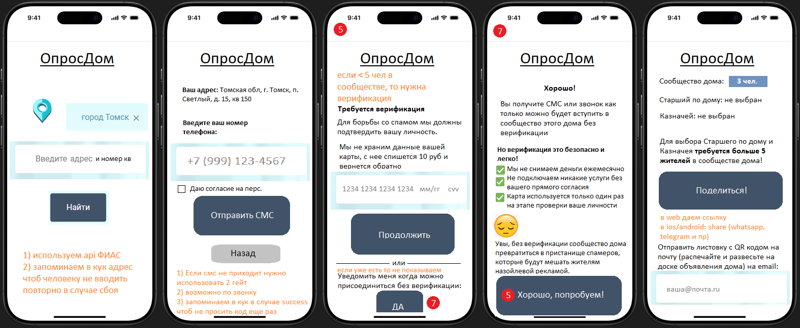

# oprosdom.ru

<h1>🏡📊Система "ОпросДом"</h1>

ОпросДом это платформа для самоуправления многоквартирными домами с прозрачными голосованиями, сборами и отчетностью. Каждый человек, проживающий в многоквартирном доме, должен быть причастен к управлению домом, а не слепо доверяться решениям УО и старшего по дому.

<h2>🔍1. Предпосылки</h2>

<h3>1.1 Проблема</h3>
<ul>
 <li>Обслуживание многоквартирных домов включает в себя: содержание общего имущества и его текущий ремонт, а также улучшения (установка чего-то нового, ранее не предусмотренного)</li>
 <li>Управляющие организации нормально справляются с содержанием общего имущества (электрика, водоснабжение, дворники, уборщицы и пр)</li>
 <li>Но в плане текущего ремонта и улучшений они порой действуют совершенно не так, как хотят жители.</li>
</ul>

<h3>1.2 Жилищный кодекс РФ</h3>
<ul>
 <li>Сейчас выработана схема с выбором на Общем собрании собственников Совета дома и Председателя совета, который в идеале должен взаимодействовать с жителями, знать их запросы, аккумулировать их и корректировать планы управляющих организаций (Управляющие компании, ТСЖ, ЖК, ЖСК и др)</li>
 <li>Но зачастую выбранный Совет дома и Председатель принимают решения без предварительного взаимодействия с жителями по тому или иному вопросу</li>
</ul>

<h3>1.3 Запрос</h3>
<ul>
 <li>Люди все больше начинают осознавать то, что их собственность начинается не с порога квартиры, а весь дом и прилегающая территория тоже их</li>
 <li>Большинство (по личному опыту, 60-70%) хотят быть причастными к принимаемым решениям.</li>
 <li>Группы в Whatsapp и Telegram отчасти помогают удовлетворить эту тягу, однако ключевой проблемой таких групп является хаос, отсутствие структурированности данных.</li>
 <li>По итогу группы превращаются из места обсуждения инициатив в банальную "чьи ключи/нашли карту и пр".</li>
 <li>Люди не хотят долгой нудной переписки, а также большинство банально стесняются показаться, как они считают, глупыми и стараются не принимать участие в обсуждении.</li>
 <li>Они хотят проголосовать за или против инициативы</li>
 <li>Единицы хотят выдвинуть свою инициативу</li>
</ul>

<h2>🎯2. Цель</h2>

Создать саморегулируемую систему взаимодействия, управления инициативами и сборами в многоквартирных домах, в которой будет выгодно находиться всем участницам, которая:

Жильцам: 

<ul>
 <li>Даст возможность участвовать в решениях через голосования</li>
 <li>Выносить свою инициативу на голосование</li>
 <li>Позволит взаимодействовать с соседями, с которыми они могут быть незнакомы лично и не иметь их контактов</li>
</ul>

Старшим по дому: 

<ul>
 <li>Упростит учет мнений и сбор средств.</li>
 <li>Частично снимет ответственность за принятое решение, так как он действует с одобрения проголосовавшего большинства</li>
 <li>Позволит удобно сформировать отчет и одной ссылкой отправить в группу whatsapp/telegram</li>
</ul>

Управляющим Организациям (Управляющие компании, ТСЖ, ЖК, ЖСК и др): 

<ul>
 <li>Легитимизирует их действия и снижает конфликты</li>
</ul>

<h2>🧱3. Ключевые особенности:</h2>
<h3>3.1 Положение</h3> 

Система ОпросДом не заменяет УО, а гармонично дополняет взаимодействие с жильцами по линии цифровизации.

<h3>3.2 Ориентация</h3>

В отличие от "Госуслуги Дом" ОпросДом ориентирован на фактически проживающих в доме людей, вне зависимости от наличия регистрации или права собственности

<h3>3.3 Саморегулирование (см. п.6)</h3> 

Саморегулирование делает проект устойчивым, справедливым и экономически выгодным

<h2>🤝4. Участники системы</h2>
<h3>4.1.🧑Жители</h3>
<ul>
 <li>Видят историю (от инициативы до реализации с приложением фоток и видео), текущие задачи и сборы в процессе, инициативы</li>
 <li>Голосуют за инициативы ("за/против"). Чем больше ЗА за инициативу, тем выше она находится в списке к исполнению</li>
 <li>Могут участвовать в обсуждении истории, текущих задач, а также инициативах. В системе каждая инициатива разделена и обсуждение только в рамках выбранной инициативы, в противовес whatsapp, где все в одной куче.</li>
 <li>Участвуют в добровольных сборах с защитой через обязательное голосование перед выводом средств.</li>
</ul>

<h3>4.2. 👔Старший по дому</h3>
<ul>
 <li>Старший по дому избирается голосованием Сообщества на основе рейтинга кандидатов</li>
 <li>Ставит резолюцию на заминусеных аккаунтах</li>
 <li>Модерирует инициативы: передает в УО или запускает сбор средств</li>
 <li>Может общаться с другими старшими по домам, расположенным поблизости</li>
 <li>Не обязательно, что старший по дому в системе ОпросДом == выбранному на Общем собрании собственников Председателю совета многоквартирного дома. Если старшего поддерживает большинство, то формализировать это через ОСС не составит большого труда.</li>
</ul>

<h3>4.3. 🧮Казначей</h3>
<ul>
 <li>Выбирается жителями посредством голосования</li>
 <li>Срок полномочий неограничен, но может быть переизбран в любой момент в результате голосования</li>
 <li>Вносит актуальные реквизиты для зачисления сбора и формулирует правила (например, какое примечание указывать и как уведомлять)</li>
 <li>Добавляет инфу по поступившим платежам (сумма, номер квартиры или номер телефона). Если неизвестно от кого перевод - спросит в приложении или в группе whatsapp/telegram
 <li>Получает вознаграждение за свой труд в % от поступивших платежей (зашиваем мин % в систему, чтобы Казначею не испытывать неудобства объявлять жителям, что работает за %)</li>
 <li>При смене Казначея в результате голосования обязан перевести казну на счет нового Казначея</li>
</ul>

<h3>4.4. 🏢Управляющая организация (УО)</h3>
<ul>
 <li>Видит, что решение о той или иной инициативе принято не единолично старшим по дому и не идет вразрез с мнением большинства. А инициатива подтверждена результатами голосования. Это позволит снизить количество жалоб от недовольных жильцов</li>
 <li>Имеет возможность сообщить об авариях (чтобы снизить нагрузку на диспетчера) или планируемых мероприятиях (например, чистка снега - чтоб жильцы убрали автомобили, покраска - чтоб люди были внимательны и следили за детьми чтоб не залезли в краску, уведомление об отключении воды). Без платной подписки это публикация статического объявления, без уведомления пользователей email, sms, push.</li>
 <li>Формирование отчетов для органов ЖКХ. Это нужно для того, чтобы в органах ЖКХ понимали, что у каждой УО есть возможность получения отчетов, чтоб УО не ссылались на платную подписку. Для того, чтобы сотрудники органов ЖКХ могли видеть реальную картину от независимой системы ОпросДом, а не от отчетов УО.</li>
</ul>

<h2>⚖️5. Саморегулирование</h2>

Жители отдельно взятого дома (Сообщество) самостоятельно регулирует вопросы без привлечения модераторов ОпросДома:
 
<ul>
 <li>выборы Старшего и Казначея</li>
 <li>удаление чужаков из Сообщества</li>
 <li>борьба со спамерами и неадекватами</li>
</ul>

<h2>💰6. Монетизация</h2>
<h3>6.1 Реклама местного бизнеса</h3>
<ul>
 <li>Мы будем иметь базу домов и собственников. У каждого дома есть адрес. Например, есть рабочий поселок на 8500 чел. Рядом предприятие, которое ищет сотрудников только в этом поселке. Мы предоставим им интерфейс для покупки рекламы. Даже можем посчитать аудиторию (мы же знаем гео + кол-во собственников). Как показывать рекламу ненавязчиво, но эффективно еще следует подумать.</li>
</ul>
<h3>6.2 Платные услуги</h3>
<ul>
 <li>Плата за буст инициативы. Например, кому-то что-то очень нужно, если действительно нужно, то мы позволяем забустить инициативу. Типа х5, х10 к голосу будет стоить сколько-то денег</li>
 <li>Плата за добавление 2+ дома (в геометрической прогрессии с каждый n+1 домом)</li>
</ul>
<h3>6.3 Платная подписка для УО</h3>
<ul>
 <li>Возможность сообщить о планируемых мероприятиях или авариях в реальном времени всеми возможными способами: email, sms/push. Для УО это снижение нагрузки на диспетчера и юр отдел.</li>
 <li>Возможность разместить свой логотоп и номер телефона диспетчера в фронт-енд приложении  для того, чтобы жители знали куда обращаться в случае аварии (в этом прежде всего должен быть заинтересован старший по дому, потому что ему меньше звонков будет и он может ссылаться на то, что смотрите номер телефона в ОпросДоме, а значит будет лоббировать подключение к системе)</li>
 <li>доступ к статистике по другим домам поблизости (сколько людей из дома в системе, кто старший, количество звонков диспетчеру и пр)</li>
</ul>

<h2>📢7. Маркетинг</h2>
<h3>7.1 Активная реклама + сарафанное радио</h3>

Сами люди будут вынуждать старшего подключить дом к системе, при хорошем вложении в рекламу с нашей стороны (видео на местных каналах, соцсети)

<h3>7.2 Брендирование </h3>

Продумать узнаваемый дизайн. Заготовить таблички красивые на все случаи жизни дома и раздавать цифрой (типа ведется видеонаблюдение или таблички с правилами использования помещения)

<h3>7.3 На функционале</h3>

Уведомление пользователей об авариях или мероприятиях через email, sms, push это прежде всего в интересах самих жильцов. Но, мы как система, не можем бесплатно предоставлять такую возможность, так как делать рассылки (например, смс) это стоит денег. Поэтому важно чтобы старший по дому инициировал голосование за подключение УО к системе ОпросДом (в удобный момент). Также важный момент это то, что старший по дому будет получать вознаграждение за платную подписку УО, но получать будет не из денег подписки, а из собственных средств системы ОпросДом. Для того, чтобы старший по дому был заинтересован в подключении к системе УО, которая обслуживает дом.

<h2>🏆8. Ожидаемый результат</h2>
<h3>8.1 Формирование сообществ</h3>

Посредством системы жители должны объединяться в Сообщества. Сообщество это жители отдельно взятого дома (в перспективе группы близко расположенных домов)

<h3>8.2 Критическая масса</h3>

Чем больше жителей дома будут состоять в Сообществе, тем эффективнее будут принимаемые решения.

Пример №1:
 

в доме 144 квартиры, только 10 жителей зарегистрированы в системе. То есть малочисленное Сообщество. Такое сообщество может существовать, но принятые решения будут соблюдаться только этими 10 жителями. Например, выбор старшего по дому скорее всего не отразит мнение большинства жителей, соответственно выбранный старший будет "виртуальным", не имеющим реальных полномочий.

🙈Выбранный на Общем собрании Председатель совета может игнорировать решения Сообщества

🙈Управляющая организация тоже всерьез не воспримет такое решение

Пример №2:
 

в доме 144 квартиры, 135 жителей зарегистрированы в системе. В таком случае при выборе старшего по дому он также будет "виртуальным" старшим, однако при необходимости большинство поддержит его и на Общем Собрании Собственников и избирет Председателем Совета дома.

🤔Выбранный на Общем собрании Председатель совета может проигнорировать решения Сообщества, однако Сообщество не простит такого демарша и виртуального старшего по дому через собрание сделают новым Председателем.

🤔Управляющая организация подумает, прежде чем делать что-то вразрез с решением хоть и виртуального, но быстро трансформирующегося при нужде в реальное Сообщество, так как такое Сообщество может на собрании выбрать другую УО.

<h3>8.3 Итог</h3>

ОпросДом должен обеспечить прозрачную связь между жителями и другими участниками процесса обслуживания многоквартирного дома

<ul>
 <li>Управляющая организация будет видеть реальные желания и претензии жителей, а не то, что сообщает Председатель совета мкд (если он выбран "по ошибке").</li>
 <li>Надзорные органы будут видеть реальные желания и претензии жителей, а не то, что сообщает Управляющая организация</li>
 <li>Органы администрации смогут видеть реальные проблемы жителей в плане ЖКХ в рамках населенного пункта</li>
</ul>

<h2>🚨9. Угрозы системе</h2>
<h3>9.1. Внешний спам</h3>

Когда специально регаются лица, не имеющие отношения к дому, для распространения рекламы

Предусмотренный механизм противодействия:

<ul>
 <li>верификации при регистрации первых Жителей</li>
 <li>в рамках Самоуправления Сообщество может жаловаться на сообщения/инициативы/сборы. Затем Старший решает какое наказание применить</li>
</ul>
<h3>9.2. Внутренний спам</h3>

Когда реальные жители дома начинают постить бесконтрольно "продам мед", "продам рассаду" и пр.

Предусмотренный механизм противодействия:

<ul>
 <li>в рамках Самоуправления Сообщество может жаловаться на сообщения/инициативы/сборы. Затем Старший решает какое наказание применить</li>
</ul>
<h3>9.3. Сборщики персональных данных</h3>

В системе для саморегулирования жителям в рамках одного дома открыты номера телефонов, номера квартир и имя (без фамилии, либо как в Сбере: Имя Ф.). Но человек может жить в нескольких домах, а значит мы должны давать ему возможность переключения между домами. Однако, таким образом могут написать бота, который зарегистрировавшись один раз будет бегать по всем домам в системе и собирать данные. 

Предусмотренный механизм противодействия:

<ul>
 <li>для таких людей, кто проживает то там то там в разных домах, вводим плату за добавление второго/третьего/... дома причем так, что каждый следующий дом добавить будет в 2 раза дороже.</li>
 <li>раз в полгода может бесплатно добавить дом (вдруг переезд)</li>
</ul>

<h2>⚙️10. Механика системы ОпросДом</h2>
<pre><code>
├── [1] Помощь системы (до формирования устойчивого Сообщества)
│    ├── даем возможность найти жителям свой дом (через онлайн, объявления с qr)
│    └── формируем Сообщество (жители отдельного взятого дома)
│         ├── на начальном этапе (когда <5 жителей дома) проводим верификацию, чтобы недопустить фейков
│         └── стартуем этап формирования (30 дней) с момента как только 5 жителей вступили в Сообщество 
│              ├── на этапе формирования Сообщества вводим менее строгие правила по выбору Старшего
│              └── через 30 дней переводим Сообщество в статус сформированного
├── [2] Саморегулирование
│    ├── [2.1] Сообщество
│    │    └── Каждый новый житель по умолчанию (даже если верифицирован) имеет неподтвержденное отношение к дому
│    │         ├── жители отмечают Я знаю/Не знакомы в списке сообщества
│    │         └── Старший по дому в этом же списке принимает решение о подтверждении
│    │            ├── если житель подтвержден, то получает галочку возле своего имени типа кв.34_Сидоров \/
│    │            └── если старшему не удается подтвердить Жителя:
│    │                └── выносится на голосование вопрос об удалении из Сообщества с указанием причины
│    │                   ├── такому жителю запрещено голосовать, создавать инициативы, но писать в обсуждениях может, однако не более 3 сообщений в день и сообщения его должны быть свернуты типа "возможно не житель дома"
│    │                   ├── если большинства проголосовали за, то чужак удаляется
│    │                   └── если против, то активность разблокируется, но статус остается неподтвержденным
│    ├── [2.2] Выборы
│    │    ├── выборы Старшего
│    │    │   ├── голосованию предшествует не прекращающееся формирование рейтинга
│    │    │   │   ├── в любой момент времени Житель может выбрать Согласен/Не знаю/Не согласен у любого кандидата в должность Старшего (если выбирает нескольких кандидатор - это хорошо, так как формируется резерв)
│    │    │   │   ├── Житель может менять свое решение о согласии в любой момент
│    │    │   │   ├── Житель может добавить себя в список кандидатов на должность Старшего
│    │    │   │   │   ├── если Житель является Казначеем или находится в списке кандидатов на Казначения - нельзя избираться Старшим
│    │    │   │   │   ├── должен кратко сформулировать свою программу
│    │    │   │   │   ├── получает предупреждение, что должен являться собственником, если планирует официально избраться Председателем.
│    │    │   │   │   └── кандидат может в любой момент снять свою кандидатуру, отмечаем в логе
│    │    │   │   └── отправка на голосование
│    │    │   │       ├── самая первая отправка на голосование производится через 10 дней после добавления первого кандидата
│    │    │   │       ├── на голосование отправляется самый популярный из рейтинга
│    │    │   │       └── в дальнейшем в любой момент времени любой может инициировать отправку на голосование за Старшего (только 1 голосование в моменте)
│    │    │   │           ├── в этом случае проверяем, если рейтинг активного Старшего также на высоте, то отказываем так как голосование не имеет смысла: голосовать за того, кто и так является Старшим
│    │    │   │           └── если рейтинг активного Старшего упал и самым популярным кандидатом стал другой - отправляем на голосование
│    │    │   └── голосование
│    │    │       ├── голосование за Старшего (в отличие от инициатив) является анонимным
│    │    │       ├── предлагается два варианта ЗА и ПРОТИВ
│    │    │       ├── срок голосования 10 календарных дней
│    │    │       └── если ПРОТИВ больше, то логируем, но ничего не делаем. Жители сами подадут еще одно голосование за того, кто на тот момент будет популярным
│    │    └── выборы Казначея
│    │        ├── голосованию предшествует не прекращающееся формирование рейтинга
│    │        │   ├── в любой момент времени Житель может выбрать Доверяю/Не знаю/Не доверяю у любого кандидата в должность Казначея (если выбирает нескольких кандидатор - это хорошо, так как формируется резерв)
│    │        │   ├── Житель может менять свое решение о доверии в любой момент
│    │        │   ├── Житель может добавить себя в список кандидатов на должность Казначея
│    │        │   │   ├── если Житель является Старшим по дому или находится в списке кандидатов на Старшего - нельзя
│    │        │   │   ├── Казначеем, в отличие от Старшего, может избираться также любой Житель, но подтвержденный
│    │        │   │   ├── должен пройти верификацию картой (своей? сможем ли так реализовать) чтоб убедиться, что счета у него не арестованы
│    │        │   │   ├── опционально предлагаем пройти проверку ФССП (не обязательно потому, что api ФССП часто не работает) и если проходит, то ставим галочку в кандидатуре что по ФССП чист
│    │        │   │   ├── предупреждаем, что Казначею лучше не быть самозанятым, но тут же пишем, что принимать по закону сборы для дома законно с отсылкой на закон!
│    │        │   │   └── кандидат может в любой момент снять свою кандидатуру, отмечаем в логе
│    │        │   └── отправка на голосование
│    │        │       ├── самая первая отправка на голосование производится через 10 дней после добавления первого кандидата
│    │        │       ├── на голосование отправляется самый популярный из рейтинга
│    │        │       └── в дальнейшем в любой момент времени любой может инициировать отправку на голосование за Казначея (только 1 голосование в моменте)
│    │        │           ├── в этом случае проверяем, если рейтинг активного Казначея также на высоте, то отказываем так как голосование не имеет смысла
│    │        │           └── если рейтинг активного Казначея упал и самым популярным кандидатом стал другой - отправляем на голосование
│    │        └── голосование
│    │            ├── голосование за Казначея (как и за Старшего) является анонимным
│    │            ├── предлагается два варианта ЗА и ПРОТИВ
│    │            ├── срок голосования 10 календарных дней
│    │            └── если ПРОТИВ больше, то логируем, но ничего не делаем, кроме как размещаем объявление что необходимо выбрать Казначея. Жители сами подадут еще одно голосование за того, кто на тот момент будет популярным
│    ├── [2.3] Самоустранение
│    │    ├── Старшего
│    │    │   └── при самоустранении Старшего он должен заявить об этом
│    │    │       ├── убираем старого Старшего из рейтинга
│    │    │       ├── начинаем процедуру актуализации рейтинга (3 дня) уведомив Жителей, что нужно чтоб они отметили тех, с кем согласны или не согласны для формирования рейтинга перед голосованием
│    │    │       └── через 3 дня автоматически стартуем голосование ЗА/ПРОТИВ
│    │    ├── Казначея
│    │    │   ├── при самоустранении Казначея он должен заявить об этом
│    │    │   │   ├── убираем старого Казначея из рейтинга
│    │    │   │   ├── начинаем процедуру актуализации рейтинга (3 дня) уведомив Жителей, что нужно чтоб они отметили тех, кому доверяют или не доверяют для формирования рейтинга перед голосованием
│    │    │   │   └── через 3 дня автоматически стартуем голосование ЗА/ПРОТИВ
│    │    │   └── Если в Казне дома (у Казначея которая) > 0, то просто так самоустраниться нельзя, нужен сменщик которому передать Казну дома
│    │    │       └── новый Казначей должен подтвердить, что принял Казну и только тогда старый Казначей лишается статуса Казначея
│    │    └── Жителя
│    │        └── отправляем Жителю смс с кодом для удаления
│    │            └── запоминаем в базе если этот Житель был подтвержден по данному адресу, то потом если захочет вернуться - не требуем подтверждения, так как он уже когда-то ранее подтверждался
│    ├── [2.4] Инициативы
│    │    ├── Житель может:
│    │    │   ├── добавить инициативу (даже если не выбран старший, нужно прост отображать предупреждение, что нужно выбрать старшего - иначе кто будет исполнять)
│    │    │   ├── участвовать в обсуждении своей/чужой инициативы
│    │    │   ├── заминусить инициативу (кроме инициатив Старшего, там можно только за/против проголосовать)
│    │    │   │   └── если больше 50% Сообщества заминусит, то инициатива сворачивается (исчезает заголовок остается только линия со стрелкой развертывания) и старший по дому имеет право такую инициативу удалить
│    │    │   ├── забустить голос при голосовании как ЗА так и ПРОТИВ
│    │    │   │   ├── буст стоит фискированную стоимость
│    │    │   │   ├── забустить можно только 1 раз в рамках одной инициативы
│    │    │   │   └── при смене решения буст сохраняет свою силу
│    │    │   └── контроллировать исполнение
│    │    │       ├── может смотреть ход работ по активным инициативам, комментировать, оставлять фотографии
│    │    │       └── ставить оценку от 1 до 5 звезд в исполненных инициативах
│    │    ├── Старший по дому:
│    │    │   ├── все тоже самое что и житель может делать
│    │    │   ├── может удалить заминусенные инициативы
│    │    │   └── по отголосовавшим инициативам определяет нужно ли устраивать сбор или через УО проблема решается (в тч через УО если требуется целевой сбор на что-то серьезное)
│    │    │       └── если требуется сбор, то пишет сумму, комментарий и создает сбор
│    │    │           └── из активных инициатив инициатива убирается, пока не будет собран сбор, в логе пишем что "инициатива ушла на сбор"
│    │    └── УО:
│    │        └── может участвовать в обсуждении инициатив как будущих так и по ходу исполнения настоящих
│    ├── [2.5] Сборы
│    │    ├── Функционал сборов доступен только если выбран активный Казначей из подтвержденных Старшим жителей
│    │    ├── Житель может:
│    │    │   ├── добавить сбор
│    │    │   │   ├── уведомляем о том, что лучше сначала создать инициативу и только после по результатам голосования проводить сбор. Но вдруг нужен быстрый сбор, поэтому разрешаем создать сбор
│    │    │   │   ├── указывает на что сбор
│    │    │   │   ├── кто будет исполнителем
│    │    │   │   ├── указывает сумму необходимую
│    │    │   │   └── устанавливает срок сбора (по умолчанию 30 дней)
│    │    │   ├── отправить деньги по сбору
│    │    │   │   ├── получает реквизиты и инструкции, сохраненные Казначеем + пишет в примечании на что сбор или номер сбора
│    │    │   │   ├── соглашается с тем, что если сумма по сбору не будет набрана полностью, то его деньги перейдут в Казну дома и в дальнейшем могут быть потрачены на другие благие дела, утвержденные голосованиями
│    │    │   │   └── отмечает то, что отправил деньги, чтобы Казначею было проще подтвердить
│    │    │   │       └── отображаем ему в сборе статус "Ваш платеж в процессе обработки. Обратитесь к Казначею если долго не подтверждает
│    │    │   ├── участвовать в обсуждении своего/чужого сбора
│    │    │   ├── заминусить сбор (кроме сборов Старшего или Казначея, там можно только за/против проголосовать)
│    │    │   │   └── если больше 50% Сообщества заминусит, то сбор сворачивается (исчезает заголовок остается только линия со стрелкой развертывания) и старший по дому имеет право такой сбор удалить
│    │    │   └── контроль зачислений
│    │    │       ├── может видеть зачислен ли его платеж по конкретному сбору (может быть стоит подсвечивать сбор зеленым, чтоб Житель знал что он уже участвовал в этом сборе), чтоб мог среагировать если Казначей долго не подтверждает прием денег
│    │    │       └── может видеть кто участвовал в этом сборе и отправленные суммы
│    │    ├── Старший по дому 
│    │    │   └── может создать сбор не только на основе отголосовавшей инициативы, но и просто как Житель
│    │    └── Казначей
│    │        ├── подтверждает прием средств
│    │        │   ├── вводит номер телефона или примечание и находит от кого и по какому сбору платеж, сверяет данные, подтверждает
│    │        │   └── если по номеру телефона или примечанию ничего не найдено, то находит в группе от кого платеж и добавляет вручную
│    │        │       └── указывает по какому сбору принят платеж, номер телефона Жителя
│    │        ├── делает возврат в исключительных случаях
│    │        │   └── убирает подтверждение у того, кто запросил возврат
│    │        ├── если сбор не набрал требуемую сумму, то может из архива вернуть сбор еще на 30 дней
│    │        └── выдает деньги инициатору сбора (переводом только по номеру телефона подтвержденного Жителя)
│    │            ├── не больше суммы сбора
│    │            ├── делает отметку о том, что деньги выданы
│    │            └── требует предоставить чеки, подтверждающие расходы для публикации в активности сбора
│    │        
│    ├── [2.6] Наказания
│    │    └── каждый Житель имеет возможность заминусить инициативу/сбор или пожаловаться на сообщение
│    │        ├── проблемные инициативы/сборы/сообщения сворачиваем
│    │        ├── того, кто их оставлял ограничиваем 3 сообщениями в сутки до разбора
│    │        └── Старший по дому принимает решение по проблемным эпизодам
│    │            ├── за нарушения, совершенные подтвержденным Жителем
│    │            │   └── Старший выбирает тип нарушения:
│    │            │       ├── спам
│    │            │       │   ├── первый раз выдается предупреждение, проблемное сообщение/инициатива/сбор - удаляются, дается рекомендация использовать рекламный сервис для рекламы его товаров или услуг
│    │            │       │   └── повторно (второе нарушение по категории спам):
│    │            │       │       ├── запрещается на 10 дней доступ ко всем полям, где можно писать текстом или вставлять картинки
│    │            │       │       ├── для разбана отправляем в рекламный сервис и пишем старшему, что первый раз нарушитель может разлокаться после оплаты рекламы (что часть денег Старшему и в Казну дома), а если будет рецидив, то дальше уже он Старший будет решать отправлять ли его в рекламный сервис или оставить забаненым
│    │            │       │       └── если >= третье нарушение оставляем возможность Старшему не отправлять в рекламный сервис, так как могут разбаном злоупотреблять
│    │            │       └── оскорбления, оффтоп, шуточные инициативы/сборы
│    │            │           ├── первый раз выдается предупреждение, проблемное сообщение/инициатива/сбор - удаляются, дается рекомендация использовать рекламный сервис для рекламы его товаров или услуг
│    │            │           ├── штраф (удваивающийся с каждым следующим нарушением, счетчик обнуляем раз в полгода)
│    │            │           └── или запрет на 10 дней доступ ко всем полям, где можно писать текстом или вставлять картинки
│    │            └── за нарушения, сделанные неподтвержденными Жителями
│    │                ├── все тоже самое что и с подтвержденным
│    │                └── дополнитель может просто забанить учетную запись навсегда, при этом все его сообщения/сборы/инициативы скрываются
│    ├── [2.7] Вознаграждения (в Самоуправлении в ответ на Наказания)
│    │    ├── Сообщество (в Казну дома)
│    │    │   ├── 50% прибыли от рекламы, показанной Жителям
│    │    │   ├── 60% за бусты, осуществленные Жителями
│    │    │   └── 70% за штрафы, оплаченные Жителями
│    │    ├── Старший по дому
│    │    │   ├── 10% прибыли от рекламы, показанной Жителям
│    │    │   ├── 10% за бусты, осуществленные Жителями
│    │    │   ├── за штрафы не получает!
│    │    │   ├── 20% от подписки УО
│    │    │   ├── при смене Старшего, остаток остается, а не переходит к новому
│    │    │   ├── снять деньги может по запросу (голосование Сообщества не требуется) 
│    │    │   └── полученная прибыль не афишируется публично
│    │    └── Казначей
│    │        ├── 1%-3% (указывает при регистрации) от поступлений в Казну средств
│    │        ├── при смене Казначея, остаток остается, а не переходит к новому
│    │        ├── снять деньги может по запросу (голосование Сообщества не требуется)
│    │        └── полученная прибыль не афишируется публично
│    └── [2.8] Казна
│         ├── внутренняя (пополняется напрямую Сообществом)
│         │   ├── остаток и пополнения видны всему Сообществу
│         │   ├── в рамках сбора Казначей переводит деньги из Казны инициатору сбора
│         │   └── если вне сбора (например, перевели больше, чем нужно было на сбор) требуется взять деньги с Казны
│         │       ├── только через голосование
│         │       └── голосование может инициировать только Старший по дому
│         └── внешняя (пополняется Сообществом косвенно в виде прибыли с рекламы, бустов, штрафов)
│             ├── остаток виден всему Сообществу
│             └── переводится только на счет активного Казначея по голосованию Сообщества
│                 ├── инициировать голосование может только Старший по дому или Казначей
│                 ├── если в процессе голосования Казначей меняется, то голосование стопается
│                 └── Казначей должен подтвердить получение денег от Системы во внутреннюю Казну и это должно быть залогировано
└── [3] Помощь системы (после формирования Сообщества):
     ├── модерируем в самых сложных случаях
     └── обеспечиваем обратную связь со всеми заинтересованными в развитии системы
</code></pre>

 
 

<h2>⚠️Важно</h2>
<ul>
 <li>Предусмотреть возможность отписки собственников от системы по собственной инициативе</li>
 <li>По сборам нужно юридическую сторону обдумать, как бы не пришлось лицензию на осуществление финансовых операций получать %)</li>
</ul>

<h2>Интерфейс</h2>
<h3>Web</h3>
<ul>
 <li>Крайне простой интерфейс чтоб любая современная бабушка разобралась. По умолчанию загружается список того, что делается в данный момент, слева - прошлое, справа - будущее. Ничего лишнего. Аутентификация по номеру тел с запоминанием на устройстве (регистрации нет, номер телефона вносит старший по дому)</li>
 <li>Приложения iOS/Android</li>
</ul>

Наброски ui начального этапа создания сообщества (когда меньше 5 жителей)

<h2>Будущее</h2>
<ul>
 <li>p2p между домами (например, если дома находятся рядом - возможность совместную инициативу/сбор объявить)</li>
 <li>ИИ: анализировать выдвигаемые инициативы и подсказывать что нужно сделать до предлагаемых изменений или подсказать как принять работы</li>
 <li>определять тенденции на основе голосований по всей стране</li>
</ul>

<h2>Очередность реализации</h2>
<h3> 🟠 I очередь (Проектная работа)</h3>

Реализация бэкенда и фронтенда (на домене oprosdom.ru) в базовой версии

Базовый функционал включает в себя:

<ul>
 <li>основание/вступление в сообщество многоквартирного дома: 
 <ul>
 <li>ввод адреса</li>
 <li>рега по смс (отдельный микросервис) - реально</li>
 <li>верификация пока фейковая (принимает любой номер карты для верификации) для демонстрации так как подключение оплаты картами требует наличия веб-сайта и подключение биллинга</li>
 <li>регулирование сообщества самими жителями</li>
 </ul>
 </li>
 <li>создание инициатив и голосование по ним</li>
</ul>

<h3> 🟡 II очередь</h3>

Подключение биллинга для верификации

Выборы Старшего по дому

Наделение полномочиями Старшего по дому

<h3> 🟡 III очередь</h3>

Выборы Казначея

Наделения Казначея полномочиями

Реализация функционала сборов p2p

